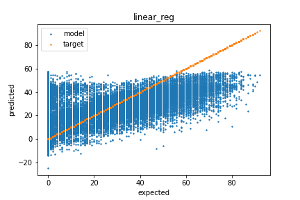
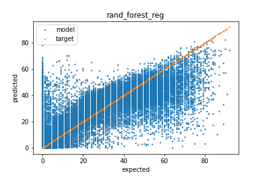
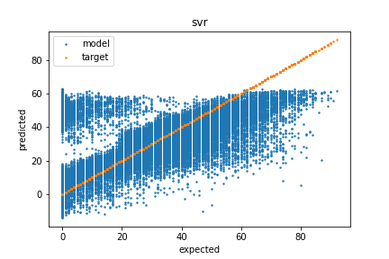
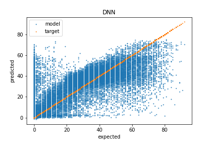

# Spotify Dataset
working with the [Kaggle Spotify Dataset 1921-2020, 160k+ Tracks dataset](https://www.kaggle.com/yamaerenay/spotify-dataset-19212020-160k-tracks)

## Overview
This project was used to predict the populatrity of a song based on various attributes. By guessing the average, a root mean squared error (RMSE) of 21.87 is achived. This is the baseline for the models to beat.

The current best algorithms are:
1. Random forest - RMSE: 12.591 (0.035)
2. DNN - RMSE: 13.56 (NA)
3. Linear Regression - RMSE: 17.172 (0.042)
4. Linear SVR - RMSE: 18.524 (0.088)

## Methods

### Data Exploration

### Data Cleaning

### Model selection 

Model were given the cleaned data and run with the default hyperparameters. 3 Fold cross validation was used to get preformance (except on DNN), and a single fold was used to show the prediction vs expected error plots. The best models were then used for hyperparameter tuning.

#### Linear Regression - RMSE: 17.172 (0.042)
The results for linear regression were not much better than guessing the average. It is likely that the data is not linearly seperable.

#### Random forest regression - RMSE: 12.591 (0.035)
The random forest model preformed the best for initial testing. Could still use some work. 

#### Linear SVR - RMSE: 18.524 (0.088)
The linear SVR had the worst performance of all models. It looks to be due to over prediction the popularity of unpopular songs. The clear seperation on the left side of the graph suggests the data is not linearly seperable. Using a different kernel might help, but SVR is likely not a good choice.

#### Deep Neural Network (DNN) - RMSE: 13.56 (NA)
The DNN used for testing had 2 hidden layers with 30 nodes and a single output layer for the regression. The preformance of the training data vs validation data suggests overfitting, but the model prefomed well in comparison to others. 

### Tuning Hyperparameters

For Hyperparameter tuning, I went with Random Forest and DNN models. Below are how I tuned the hyperparameters

#### Random forest regression

#### Deep Neural Network (DNN)

### Generalization 
