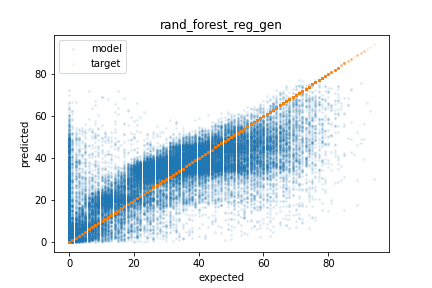

# Kaggle-Dataset-Work
My projects working on various Kaggle datasets

# Projects
## Pneumonia classification form chest x-ray images (Feb 12, 2021 - Present)
Working with the [Chest X-Ray Images (Pneumonia)](https://www.kaggle.com/paultimothymooney/chest-xray-pneumonia)

See the current [writeup](pneumonia_xray_image/README.md) and [jupyter notebook](pneumonia_xray_image/pneumonia_data_exp_and_model_training.ipynb) for more details.

## Spotify song populartity regression (Feb 8, 2021 - Feb 12, 2021)
Working with the [Kaggle Spotify Dataset 1921-2020, 160k+ Tracks dataset](https://www.kaggle.com/yamaerenay/spotify-dataset-19212020-160k-tracks)

Trained RandomForest, DNN, LinearRegression, and LinearSVR to predict songs populartiy. Obtained a RMSE error of 12.300 which is nearly 2x more accurate than guessing the average popularity.
See the [writeup](spotify_dataset/README.md) and [jupyter notebook](spotify_dataset/Data-exploration-and-regression.ipynb) for more details.

