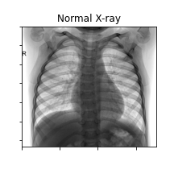

# Pneumonia classification from chest x-ray images 
Working with the [Chest X-Ray Images (Pneumonia) dataset](https://www.kaggle.com/paultimothymooney/chest-xray-pneumonia)

This project is currently being worked on.

## Overview

## Methods

### Data Exploration

The dataset is split into a train, validation, and test sets with 5219, 19, and 627 images respectively. Due to the small size of the the validation set, I have merged the train and validation set and will use a train test split to make a larger validation set. 

#### Looking at raw data
The X-ray images have a range of aspect ratio and resolutions that will need to be dealt with before they can be used for machine learning. Here are some examples of normal, bacterial pneumonia, and viral pneumonia.

After reading in the data, I calculated some stats related to the images and plotted them as histograms by classification shown below. Looking at the data, the normal data is both higher resolution and has a different aspect ratio than the pneumonia positive dataset. The images must be resized to allow for them to be fed into the machine learning model, so the higher resolution is not an issue. The aspect ratio, however, could lead to the model learning that more compressed images are normal without learning learning anything medically relevant infromation. The result could be pour generalization of the model. Ideally, collecting more varied normal data would address this, but I will look at center cropping in the next section for the purposes of this study.

The mean of the data is simialr across all datasets showing the exposure is similar and the standard deviation shows a slight seperation between the bacterial pneumonia from the viral and normal x-rays. 

After rescaling the data set to 125x125 pixels, the average of the training set for normal, bacterial, and viral classes are shown below.

#### Center cropping

To address the aspect ratio issue, I ran the same analysis on images that have been cropped around the center so they are square. As you can see, the aspect ratio issue is gone. Additionally, there is better seperation with respect to the mean and std of the pixels for the different classes. This maybe an exposure artifact, but it matches the more blurry images associated with pneumonia X-rays.

After rescaling the center cropped data set to 125x125 pixels, the average of the training set for normal, bacterial, and viral classes are shown below.

### Data Pipeline

### Model selection 

### Generalization 

### Summary and Outlook
