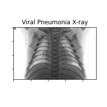
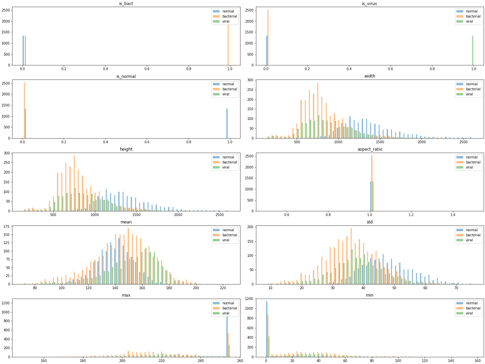

# Pneumonia classification form chest x-ray images 
Working with the [Chest X-Ray Images (Pneumonia)](https://www.kaggle.com/paultimothymooney/chest-xray-pneumonia)

## Overview

## Methods

### Data Exploration

#### Looking at raw data

An average image looks like

#### Center cropping

An average image looks like

### Data Pipeline

### Model selection 

### Generalization 

### Summary and Outlook
