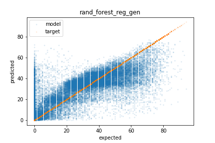
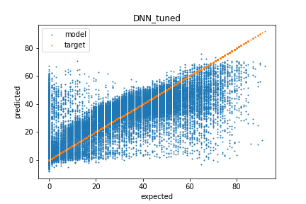

# Spotify Dataset
Working with the [Kaggle Spotify Dataset 1921-2020, 160k+ Tracks dataset](https://www.kaggle.com/yamaerenay/spotify-dataset-19212020-160k-tracks). See [this jupyter notebook](Data-exploration-and-regression.ipynb) for the code for this project.

## Overview
This project uses tool from Keras/TensorFlow, Scikit-Learn, Pandas, Numpy, TensorBoards, and Matplotlib to predict the populatrity of a song based on various attributes. This tool could be used to filter songs submitted to a record label in order to lighten the human workload of reviewing new music.

By guessing the average of the train data set and comparing it to the test dataset, a root mean squared error (RMSE) of 21.85 is achieved. This can be used a baseline to help understand model performance.

The best algorithms are:
| Model | Base RMSE | Tuned RMSE | Generalized RMSE |
|-------|-----------|------------|------------------|
| RandomForest | 12.59 | 12.52 | 12.30 |
| DNN | 13.56 | 12.94 | 12.78 |
| LinearRegression | 17.172 | NA | NA |
| LinearSVR | 18.524 | NA | NA |

The images below show the results of running the RandomForest (left) and DNN (right) models on the test set. As you can see, much of the error is over predicting the popularity of unpopular songs. Even with these errors, this predictor would likely help lighten the workload for human reviewers. Additionally, both models struggle to predict highly popular songs which is likely due to limited data in the training sets. Giving highly popular songs higher weight during training could correct this at the cost of reduce overall performance.

## Methods
Prior to examining the data, duplicate rows were deleted and a testing set was set aside to be used later to measure how well the models generalize. 

### Data Exploration
The dataset contains 19 attributes and 172,230 unique entries. 4 of the attributes are text based which are dropped, 1 is the label (popularity), and the remaining 14 are used as inputs to the models. They are:
- acousticness    
- danceability    
- duration_ms     
- energy          
- explicit        
- instrumentalness
- key             
- liveness        
- loudness        
- mode            
- popularity      
- speechiness     
- tempo           
- valence         
- year   

Looking at the correlation matrix, acousticness, energy, instrumentalness, loudness, and year are most correlated to popularity. The scatter matrix does not show any non linear correlations.

### Data Pipeline
The following text based attributes were dropped.
- 'artists'
- 'id'
- 'name'
- 'release_date'

The 'artists' attribute could be used via hot ones, but this would lead to a large number of input parameters. The dataset also has a 'year' attribute making 'release_data' somewhat redundant. 

After the text attributes were remove, the data was passed through sklear-learn's standard scaler to normalize the data before being used for training.

### Model selection 
Models were given the cleaned data and run with the default hyperparameters. 3 Fold cross validation was used to get performance (except on DNN), and a single fold was used to show the prediction vs expected error plots. The best models were then used for hyperparameter tuning.

#### LinearRegression - RMSE: 17.172 (0.042)
The results for LinearRegression were not much better than guessing the average. It is likely that the data is not linearly separable.

#### RandomForest - RMSE: 12.591 (0.035)
The RandomForest model preformed the best for initial testing. The model could still use some work. 

#### LinearSVR - RMSE: 18.524 (0.088)
The LinearSVR had the worst performance of all models in terms of RMSE. It looks to be due to over prediction the popularity of unpopular songs. The clear separation on the left side of the graph suggests the data is not linearly separable, but using other kernels may help. If over predicting unpopular songs is not an issue for the given application, the LinearSVR model does capture the trend for more popular songs quite well. That being said, it did not make the short list of models for tuning.

#### Deep Neural Network (DNN) - RMSE: 13.56 (NA)
The DNN used for testing had 2 hidden layers with 30 nodes and a single output layer for the regression. The performance of the training data vs validation data suggests over fitting, but the model preformed well in comparison to others. 

### Tuning Hyperparameters
For hyperparameter tuning, I went with RandomForest and DNN models. Below are how I tuned the hyperparameters

#### DNN
The DNN was trained using Keras/TensorFlow and the training was monitored with a TensorBoard. I used a few iterations of grid search to fine tune the model's hyperparameters including the number of hidden layers, neurons per layer, and the learning rate. After tuning, the best DNN performance had a RMSE of 12.95 on the validation set compared to the base model RMSE of 13.56. The tuned model has 4 hidden layers with 25 neurons each and was trained with a learning rate of 1e-5. Below is the results of predicting the validation set showing that much of the error occurs by over predicting the popularity of unpopular songs.

#### RandomForest
The RandomForest model was tuned using the RandomizedSearchCV function from sklearn. The n_estimators, max_features, max_depth, min_samples_split, min_samples_leaf, and bootstrap features were allowed to vary. The best model had n_estimators=1100, min_samples_split=3, min_samples_leaf=2, max_features='auto', max_depth=20, and bootstrap=True. It achieved a RMSE of 12.52 on the validation which was a slight improvement from 12.59 of the base model.

### Generalization 

To test the generalization of the models, the RMSE on the test set was calculated. The RandomForest (left) achieved a RMSE of 12.30 and the DNN (right) achieved a RMSE of 12.78. Surprisingly both models preformed better on the test set when compared to the validation set. 

### Summary and Outlook
The RandomForest algorithm preformed the best with a RMSE of 12.30 on the test set which is nearly 2x more accurate than guessing the average popularity. Both the RandomForest and DNN models struggled at over predicting unpopular songs as well under predicting very popular songs. However, they were both able to capture the main trends in the data. Using weights on vary popular and unpopular songs when training the model may improve edge performance, but could lead to a higher overall RMSE. In the future, it would be nice to look at feature selection using the RandomForest's feature_importances_ parameter to see if dropping unimportant features could improve the models performance. 
